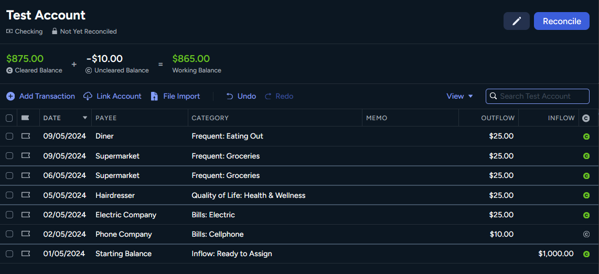

## What is this?

A YNAB (https://app.ynab.com) browser plugin that helps users view their date sorted transactions clearly with borders around each day.

**Before:**


**After:**



## How to Use

### Firefox

From https://developer.mozilla.org/en-US/docs/Mozilla/Add-ons/WebExtensions/Your_first_WebExtension
> In Firefox: Open the about:debugging page, click the This Firefox option, click the Load Temporary Add-on button, then select any file in your extension's directory.

### Chrome

..todo

### Without extension, using dev tools (F12) [FOR DEVELOPMENT ONLY!]

Open browser dev tools and then enter the following in the console. This will render borders around the transactions for given dates.

```js
// fetch a list of all the date elements
let dateElementsOnAccountPage = document.querySelectorAll('.ynab-grid-cell-date.user-data')
// start from 1 instead of 0, because we compare current date with previous date to decide if we want to draw a top border
for(let i = 1; i < dateElementsOnAccountPage .length; i++){
    if(dateElementsOnAccountPage[i-1].innerHTML.trim() !== dateElementsOnAccountPage [i].innerHTML.trim()){
        dateElementsOnAccountPage[i].parentElement.style.borderTop = '2px solid #405163'
    }
}
```

## Disclaimer

This project is not affiliated with YNAB (https://www.ynab.com/), it's just a brower plugin to help solve this specific problem and make the UI more accessible.
